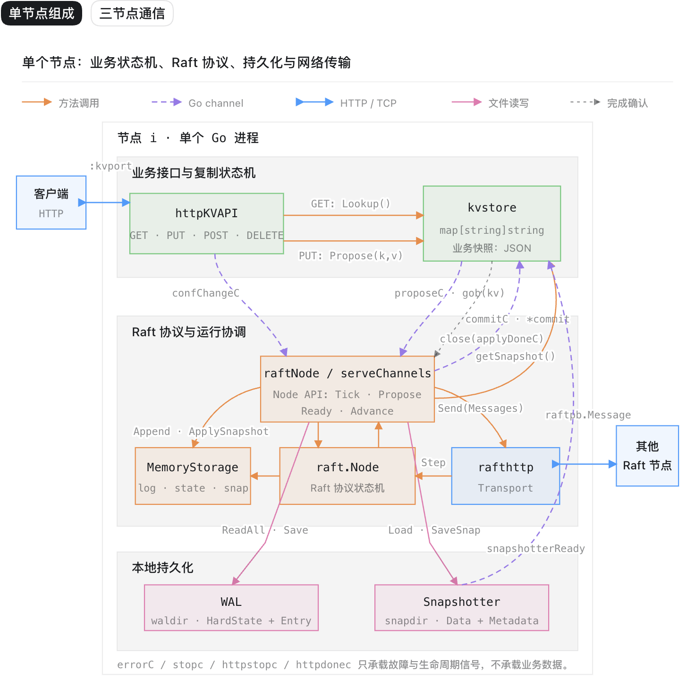

# kvstore

`kvstore` 是一个使用 [etcd/raft](https://github.com/etcd-io/raft) 实现的分布式键值存储示例。每个节点运行在一个独立的 Go 进程中，通过 Raft 复制写命令，并在本地按相同顺序应用已经提交的日志，从而让各节点维护一致的内存键值状态。

> 这是用于理解 Raft 集成方式的示例项目，不是可直接用于生产环境的完整数据库。

## 系统架构

下图展示了单个节点内部的组件，以及该节点与客户端、其他 Raft 节点之间的关系。



一个节点由五个部分组成：

| 层次 | 主要组件 | 职责 |
| --- | --- | --- |
| 客户端接口 | `httpKVAPI` | 接收 `GET`、`PUT`、`POST` 和 `DELETE` 请求，并将其转换为本地查询、业务提案或成员变更提案 |
| 复制状态机 | `kvstore` | 保存 `map[string]string`，按 Raft 提交顺序执行写命令，并生成或恢复 JSON 业务快照 |
| Raft 运行协调 | `raftNode`、`serveChannels` | 驱动逻辑时钟，接收提案，处理 `Ready`，协调持久化、消息发送、日志应用和快照 |
| 共识与节点通信 | `raft.Node`、`MemoryStorage`、`rafthttp.Transport` | 执行 Raft 协议状态机，在内存中提供日志视图，并通过 HTTP/TCP 与其他节点交换 Raft 消息 |
| 本地持久化 | `WAL`、`Snapshotter` | 分别保存 Raft 的增量日志/`HardState`，以及带有业务数据和 Raft 元数据的完整快照 |

每个节点对外提供两个彼此独立的 HTTP 服务：

- 客户端 HTTP 服务监听 `-port`，负责键值操作和成员变更。
- Raft HTTP 服务监听当前节点在 `-cluster` 中对应的地址，只负责节点间日志复制、心跳和快照传输。

## 核心数据流

### 写入链路

以 `PUT /foo`、请求体为 `bar` 为例：

1. `httpKVAPI` 接收请求，调用 `kvstore.Propose("/foo", "bar")`。
2. `kvstore` 将 `{Key, Val}` 编码为一条命令，通过 `proposeC` 交给 `raftNode`。
3. `raftNode` 调用 `raft.Node.Propose`；提案最终由 Leader 通过 `rafthttp` 复制到其他节点。
4. 多数派确认后，该命令出现在各节点 `Ready.CommittedEntries` 中。
5. 节点先把新的 `HardState` 和日志条目写入 WAL，再发送依赖这些状态的网络消息。
6. `publishEntries` 将已经提交的业务命令通过 `commitC` 交给 `kvstore.readCommits`。
7. `kvstore` 按日志顺序更新本地 map，完成后关闭 `applyDoneC`，通知 Raft 协调层状态机已经应用完该批命令。

所有业务写入都应先进入 Raft，不能绕过日志直接修改 map。集群中的存活节点只要按相同顺序应用相同的已提交日志，就会得到相同的键值状态。

当前 HTTP 写接口采用异步确认：`204 No Content` 表示请求已经被节点接收并送入提案通道，不表示该写入已经被多数派提交或持久化。因此，客户端在 `PUT` 返回后立即发起 `GET`，仍可能暂时读到旧值。

### 读取链路

`GET /foo` 不进入 Raft，而是由 `httpKVAPI` 直接调用本节点的 `kvstore.Lookup`：

```text
Client -> httpKVAPI -> kvstore.Lookup -> local map
```

这种读取路径开销小，但它没有执行 Leader 校验或 Raft `ReadIndex`。Follower 尚未应用最新提交日志时可能返回旧值，所以当前实现提供的是本地已应用状态读取，而不是线性一致读。

### 成员变更

成员变更与普通写入一样，必须经过 Raft 共识：

- `POST /<node-id>`：请求体是新节点的 Raft HTTP 地址，用于提议增加成员。
- `DELETE /<node-id>`：用于提议移除成员。

请求经 `confChangeC` 进入 `raft.Node.ProposeConfChange`。配置日志提交后，各节点调用 `ApplyConfChange` 更新 Raft 成员集合，并同步调用 `transport.AddPeer` 或 `transport.RemovePeer` 更新网络连接。这样可以避免不同节点直接修改成员列表而产生不一致的集群视图。

## `Ready` 处理顺序

`serveChannels` 是节点的核心事件循环。对于每一批 `raft.Node.Ready()`，处理顺序为：

1. 持久化新快照（如果存在）。
2. 将 `HardState` 和新增日志写入 WAL。
3. 把快照和新增日志更新到 `MemoryStorage`。
4. 通过 `rafthttp.Transport` 发送出站 Raft 消息。
5. 把已提交日志发布给业务状态机。
6. 在达到阈值时生成业务快照并压缩内存日志。
7. 调用 `raft.Node.Advance()`，确认本批 `Ready` 已处理完成。

其中“先持久化，后发送消息”是重要的安全边界：节点不能先向其他成员宣称自己已经接受某个状态，再把该状态留在尚未落盘、崩溃后无法恢复的位置。

## 存储与故障恢复

每个节点使用两个独立目录：

| 目录 | 内容 |
| --- | --- |
| `kvstore-<id>/` | WAL：Raft 日志条目、任期、投票和提交位置等 `HardState` |
| `kvstore-<id>-snap/` | 快照：JSON 编码的完整键值数据，以及索引、任期和成员配置等 Raft 元数据 |

节点重启时按以下顺序恢复：

1. 查找具有有效 WAL 快照检查点的最新快照。
2. 将快照应用到 `MemoryStorage`，并恢复业务 map。
3. 从快照位置之后读取 WAL，恢复 `HardState` 和剩余日志。
4. 使用 `raft.RestartNode` 从恢复出的协议状态继续运行。

默认累计应用超过约 `10000` 条新日志后触发快照。生成快照前，Raft 协调层通过 `applyDoneC` 等待业务状态机完成对应日志的应用，以保证快照中的业务数据与其日志索引一致。快照完成后仍在 `MemoryStorage` 中保留最近约 `10000` 条日志，让短暂落后的 Follower 可以通过增量日志追赶；落后更多时则需要传输完整快照。

`MemoryStorage` 只为运行中的 Raft 协议提供快速日志访问，本身不承担进程重启后的持久化；可恢复性来自 WAL 和快照。

## 进程内通道

组件之间主要通过 Go channel 解耦：

| 通道 | 方向 | 作用 |
| --- | --- | --- |
| `proposeC` | `kvstore` → `raftNode` | 传递编码后的键值写命令 |
| `confChangeC` | `httpKVAPI` → `raftNode` | 传递成员增删提案 |
| `commitC` | `raftNode` → `kvstore` | 按顺序发布已提交命令；`nil` 表示重新加载快照 |
| `applyDoneC` | `kvstore` → `raftNode` | 确认一批已提交命令已应用完成 |
| `snapshotterReady` | `raftNode` → `main` | 在快照组件初始化后将其交给业务状态机 |
| `errorC`、`stopc`、`httpstopc`、`httpdonec` | 生命周期控制 | 传播后台错误并协调 Raft 循环、传输层和 HTTP 服务的关闭 |

这些通道只负责单个进程内的组件协作；跨节点通信全部由 `rafthttp.Transport` 通过 HTTP/TCP 完成。

## 一致性边界

- **写入顺序**：由 Raft 日志保证，只有多数派提交后的命令才会应用到业务状态机。
- **写入响应**：当前接口不等待提交完成，HTTP 成功响应不能作为写入已生效的证明。
- **读取一致性**：读取本节点已应用状态，可能读到旧数据；如需线性一致读，需要增加 Leader/租约校验或 `ReadIndex` 流程。
- **故障容忍**：在集群仍可联系多数派时可以继续提交写入；失去多数派时不能安全地产生新的已提交日志。
- **磁盘恢复**：WAL 保存增量协议状态，快照提供压缩后的恢复基线，两者共同构成完整恢复链路。

## 代码导览

| 文件 | 说明 |
| --- | --- |
| `kvstore/main.go` | 解析启动参数，创建通道并装配 Raft、状态机和客户端 HTTP 服务 |
| `kvstore/httpapi.go` | 客户端 HTTP API 与成员变更入口 |
| `kvstore/kvstore.go` | 内存键值状态机、命令编码/应用、业务快照生成与恢复 |
| `kvstore/raft.go` | Raft 节点生命周期、WAL/快照、`Ready` 处理和节点间传输 |
| `kvstore/listener.go` | 支持停止信号和 TCP keep-alive 的 Raft HTTP 监听器 |
