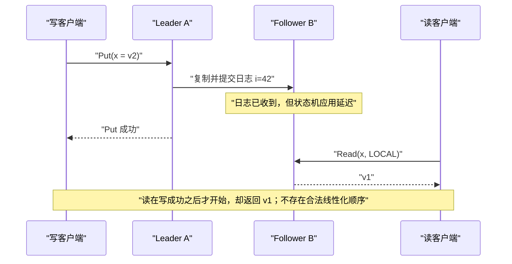
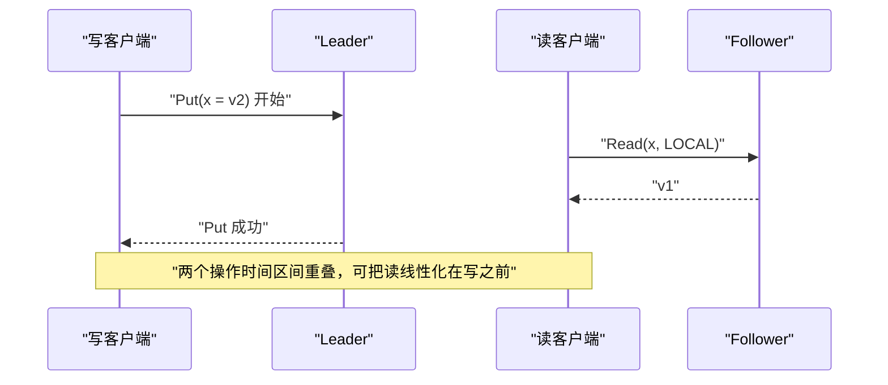
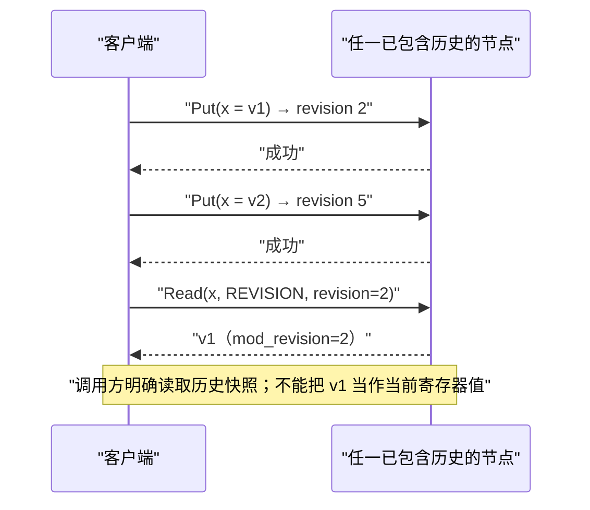
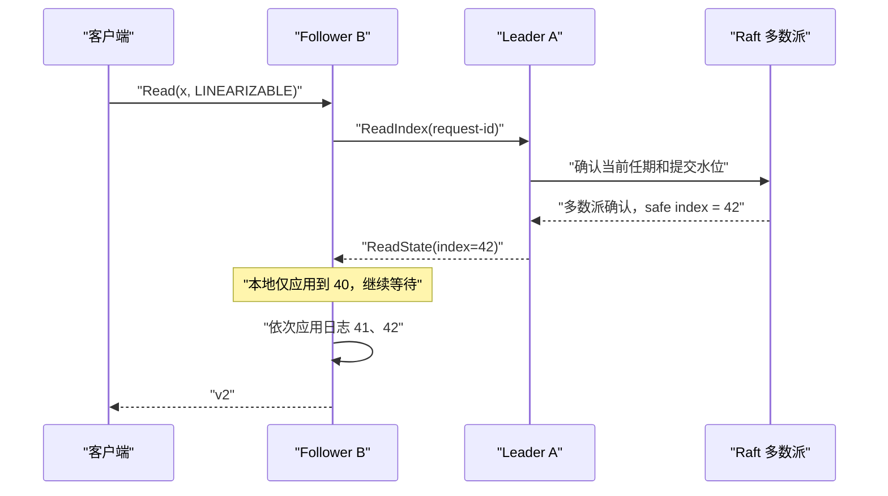
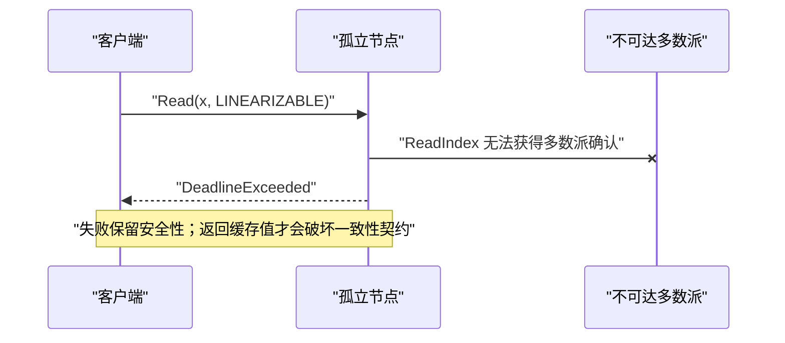

# kvstore

`kvstore` 是一个基于 [etcd/raft](https://github.com/etcd-io/raft) 的版本化键值存储示例。客户端接口使用 gRPC，支持复制写入、删除、历史版本读取、本地读取和线性一致读取。

> 本项目用于演示 Raft 状态机、ReadIndex 和 MVCC 版本读取，不是可直接用于生产环境的完整数据库。

## 快速开始

### 环境要求

- Go 1.26 或更高版本
- 可选：[grpcurl](https://github.com/fullstorydev/grpcurl)，用于执行下面的命令行示例
- 仅在重新生成 RPC 代码时需要 `protoc`、`protoc-gen-go` 和 `protoc-gen-go-grpc`

### 启动单节点

```bash
go run ./cmd/kvstore \
  -id=1 \
  -cluster=http://127.0.0.1:9021 \
  -port=9121
```

- `9021` 是 Raft 节点间通信端口。
- `9121` 是客户端 gRPC 端口。
- 节点数据保存在当前目录的 `kvstore-1/` 和 `kvstore-1-snap/` 中。

服务启用了 gRPC Server Reflection 和标准健康检查：

```bash
grpcurl -plaintext \
  -d '{"service":"kvstore.v1.KVStore"}' \
  127.0.0.1:9121 grpc.health.v1.Health/Check
```

预期状态为 `SERVING`。

### 启动三节点集群

分别在三个终端中运行：

```bash
go run ./cmd/kvstore -id=1 -port=9121 \
  -cluster=http://127.0.0.1:9021,http://127.0.0.1:9022,http://127.0.0.1:9023
```

```bash
go run ./cmd/kvstore -id=2 -port=9122 \
  -cluster=http://127.0.0.1:9021,http://127.0.0.1:9022,http://127.0.0.1:9023
```

```bash
go run ./cmd/kvstore -id=3 -port=9123 \
  -cluster=http://127.0.0.1:9021,http://127.0.0.1:9022,http://127.0.0.1:9023
```

## RPC 契约

接口定义位于 [`api/kvstore/v1/kvstore.proto`](api/kvstore/v1/kvstore.proto)。服务端注册以下服务：

| 服务 | RPC | 说明 |
| --- | --- | --- |
| `kvstore.v1.KVStore` | `Put` | 复制写入；本节点应用已提交日志后返回 |
| `kvstore.v1.KVStore` | `Delete` | 复制删除；删除不存在的键是幂等成功 |
| `kvstore.v1.KVStore` | `Read` | 按 `mode` 执行本地读、版本读或线性一致读 |
| `kvstore.v1.Cluster` | `AddMember` | 提议增加 Raft 成员 |
| `kvstore.v1.Cluster` | `RemoveMember` | 提议移除 Raft 成员 |

键最大为 4096 字节，值最大为 4 MiB。键和值都是 protobuf `string`，应使用有效的 UTF-8 文本。

### 写入

```bash
grpcurl -plaintext \
  -d '{"key":"theme","value":"dark"}' \
  127.0.0.1:9121 kvstore.v1.KVStore/Put
```

示例响应：

```json
{
  "record": {
    "key": "theme",
    "value": "dark",
    "createRevision": "2",
    "modRevision": "2",
    "version": "1"
  }
}
```

`Put` 成功表示命令已经通过 Raft 提交并在处理请求的节点完成应用。响应中的版本字段含义如下：

| 字段 | 含义 |
| --- | --- |
| `create_revision` | 该键第一次创建时的全局逻辑版本 |
| `mod_revision` | 当前记录产生时的全局逻辑版本 |
| `version` | 该键累计产生的记录数，从 1 开始 |
| `deleted` | 当前记录是否为删除墓碑 |

protobuf JSON 会把 `uint64` 显示为字符串；Go 客户端中对应字段仍是 `uint64`。

### 删除

```bash
grpcurl -plaintext \
  -d '{"key":"theme"}' \
  127.0.0.1:9121 kvstore.v1.KVStore/Delete
```

存在的键会生成墓碑记录并推进逻辑版本。删除不存在或已经删除的键不会生成新版本，响应中的 `record` 为空。

### 读取模式

`ReadRequest.mode` 支持三种显式模式。`READ_MODE_UNSPECIFIED` 会在服务端规范化为 `READ_MODE_LINEARIZABLE`，避免调用方遗漏字段时意外降级为弱一致性读取。

| 模式 | 是否联系 Raft 多数派 | 返回内容 | 典型用途 |
| --- | --- | --- | --- |
| `READ_MODE_LOCAL` | 否 | 本节点当前已经应用的最新记录 | 延迟敏感、允许短暂旧值的缓存或监控读取 |
| `READ_MODE_REVISION` | 否 | 本节点历史中指定逻辑版本可见的记录 | 审计、可重复读取、回看历史状态 |
| `READ_MODE_LINEARIZABLE` | 是，使用 `ReadIndex` | 不早于读取开始前已完成写入的状态 | 配置、锁、选主、余额等强一致业务 |

#### 本地读

```bash
grpcurl -plaintext \
  -d '{"key":"theme","mode":"READ_MODE_LOCAL"}' \
  127.0.0.1:9122 kvstore.v1.KVStore/Read
```

本地读不会发起 `ReadIndex`。Follower 尚未应用最新提交日志时可能返回旧值，但在节点与多数派失联时仍可能成功。

#### 版本读

```bash
grpcurl -plaintext \
  -d '{
    "key":"theme",
    "mode":"READ_MODE_REVISION",
    "revision":"2"
  }' \
  127.0.0.1:9122 kvstore.v1.KVStore/Read
```

版本读要求 `revision > 0`。查询会返回在该全局逻辑版本上最后可见的键记录，而不要求该键正好在该版本发生修改。例如键在版本 2 写入、版本 5 更新，则查询版本 3 或 4 都返回版本 2 的记录。

如果请求版本大于本节点已经应用的版本，RPC 返回 `OutOfRange`。版本读只访问本地历史，不承诺当前状态的线性一致性。

#### 线性一致读

显式指定模式：

```bash
grpcurl -plaintext -max-time 3 \
  -d '{"key":"theme","mode":"READ_MODE_LINEARIZABLE"}' \
  127.0.0.1:9122 kvstore.v1.KVStore/Read
```

也可以省略 `mode`，服务端默认执行相同的线性一致读取：

```bash
grpcurl -plaintext -max-time 3 \
  -d '{"key":"theme"}' \
  127.0.0.1:9122 kvstore.v1.KVStore/Read
```

服务端通过 Raft `ReadIndex` 获取安全读取索引，再等待本节点的应用水位达到该索引后查询状态机。服务端默认最多等待 5 秒；客户端应同时设置符合业务要求的、更短或相等的 deadline。

## 线性一致性场景图

线性一致性要求：每个操作都能被解释为在“调用与返回之间”的某个瞬间原子发生，并且真实时间上已经完成的操作必须排在后来开始的操作之前。

### 场景一：写入已返回，Follower 本地读到旧值——违反线性一致性



这里的问题不是 Raft 提交顺序错误，而是本地读绕过了读取屏障。它只看到 Follower B 的已应用状态。

### 场景二：读与写并发，本地读到旧值——不一定违反



返回旧值本身并不足以证明违反线性一致性。只有当旧值读取发生在新写入已经完成之后，真实时间顺序才排除了“读在写之前发生”的解释。不过，本地读作为一个接口模式仍然没有线性一致性保证。

### 场景三：版本读在写入完成后返回历史值——符合版本读契约，但不是当前值线性一致读



版本读的对象是“键在指定 revision 的历史视图”，不是“键的当前值”。因此它可以稳定返回 `v1`，但不能替代需要当前状态线性一致性的读取。

### 场景四：ReadIndex 阻止落后 Follower 返回旧值



线性一致读可以由 Follower 接收，但必须通过 Leader/多数派确认安全索引，并等待本地状态机追上。如果集群失去多数派，服务宁可返回 deadline 错误，也不会降级为本地旧值：



## gRPC 状态码

| 状态码 | 典型原因 | 客户端建议 |
| --- | --- | --- |
| `InvalidArgument` | 空键、非法读模式、版本参数组合错误、非法成员地址 | 修正请求，不要原样重试 |
| `NotFound` | 键在目标状态不存在或当时已删除 | 按业务处理不存在 |
| `OutOfRange` | 版本读请求了本节点尚未应用的未来版本 | 换更新的节点，或等待后重试 |
| `ResourceExhausted` | 节点上的并发写回执或 ReadIndex 等待项达到上限 | 退避并限制客户端并发 |
| `DeadlineExceeded` | 一致读无法及时取得多数派确认或等待本地应用超时 | 检查 quorum 和复制延迟，按幂等性决定重试 |
| `Canceled` | 客户端取消上下文 | 通常停止后续处理 |
| `Unavailable` | Raft 提案、读取或成员变更暂时不可用；写结果也可能未知 | 退避重试；写入重试前先查询状态或使用业务幂等键 |

特别注意：写请求返回 `Unavailable` 且提示 outcome unknown 时，该写入仍可能随后提交。客户端不能简单地把错误理解为“确定没有写入”。

## 成员变更

增加成员：

```bash
grpcurl -plaintext \
  -d '{"memberId":"3","raftUrl":"http://127.0.0.1:9023"}' \
  127.0.0.1:9121 kvstore.v1.Cluster/AddMember
```

移除成员：

```bash
grpcurl -plaintext \
  -d '{"memberId":"3"}' \
  127.0.0.1:9121 kvstore.v1.Cluster/RemoveMember
```

`accepted: true` 只表示本地 `raft.Node` 接受了配置变更提案，不表示配置日志已经由多数派提交。

## 版本规则

- 全局逻辑版本初始值为 1。
- 每次有效 `Put` 推进一次全局逻辑版本。
- 删除存在的键会追加墓碑并推进版本。
- 删除不存在或已经删除的键不推进版本。
- `create_revision` 在键删除后重新创建时仍保留最初创建版本。
- `version` 是单个键的记录计数，更新、墓碑和墓碑后的重新创建都会递增。
- 逻辑版本与 Raft 日志索引不是同一概念；无效果删除和 Raft 配置日志可以占用日志索引而不推进逻辑版本。

## 生成与验证

生成 protobuf 和 gRPC Go 代码：

```bash
protoc \
  --go_out=. --go_opt=paths=source_relative \
  --go-grpc_out=. --go-grpc_opt=paths=source_relative \
  api/kvstore/v1/kvstore.proto
```

生成文件为 `kvstore.pb.go` 和 `kvstore_grpc.pb.go`，不要手工修改。

运行测试：

```bash
go test ./...
go test -race ./...
```

测试覆盖状态机版本历史、Raft ReadIndex 等待、写入回执、快照恢复、三种 RPC 读取模式、gRPC 状态码和真实 protobuf/gRPC 进程内往返。
