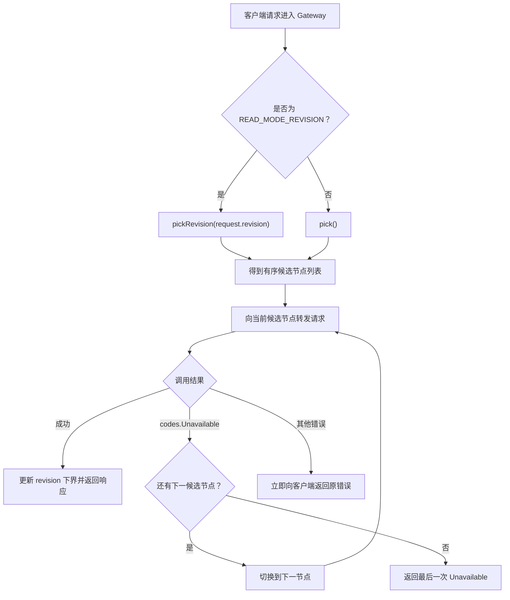

# Gateway

Gateway 对外暴露与 RaftNode 相同的 gRPC 契约，并使用 `backendPool` 返回的候选顺序转发请求。

启动三个 RaftNode 后运行：

```bash
go run ./cmd/gateway \
  -listen=:9120 \
  -backends=1=127.0.0.1:9121,2=127.0.0.1:9122,3=127.0.0.1:9123
```

客户端统一连接 Gateway：

```bash
grpcurl -plaintext \
  -d '{"key":"theme","mode":"READ_MODE_LOCAL"}' \
  127.0.0.1:9120 kvstore.KVStore/Read
```

健康检查：

```bash
grpcurl -plaintext \
  -d '{"service":"kvstore.KVStore"}' \
  127.0.0.1:9120 grpc.health.v1.Health/Check
```

## 路由策略



图中 `pick()` 处理 `Put`、`Delete`、成员变更、本地读、线性读和未指定模式的读；`pickRevision()` 只处理版本读。只有 `codes.Unavailable` 表示当前节点不可达并触发下一候选，其他结果不会切换节点。

Gateway 会把客户端传入的 gRPC metadata 转发给 RaftNode。成功响应中的 revision 会作为该节点已应用进度的下界写回 Pool。

后端列表目前是静态配置。Raft 成员变化不会自动修改 Gateway 的 `-backends` 参数。
